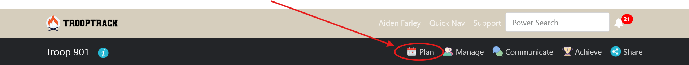
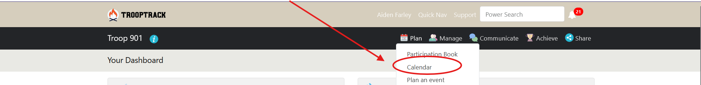
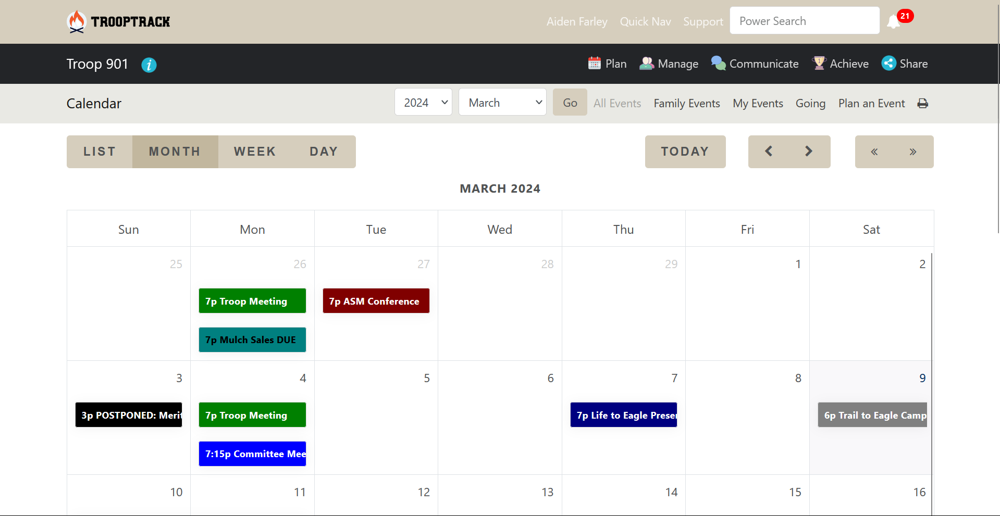

# Accessing the Calendar
1. Login to trooptrack by following the guide [here](./login.md)
2. Click the `Plan` button on your topbar

3. Press `Calendar` in the dropdown

4. You are now on the troop calendar!
