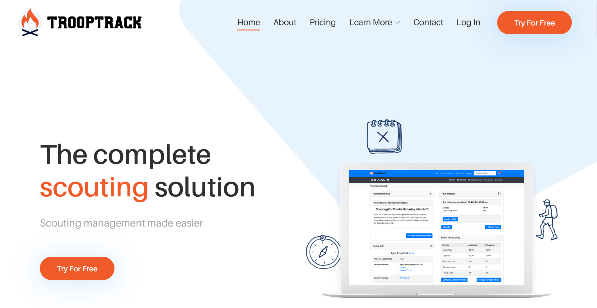
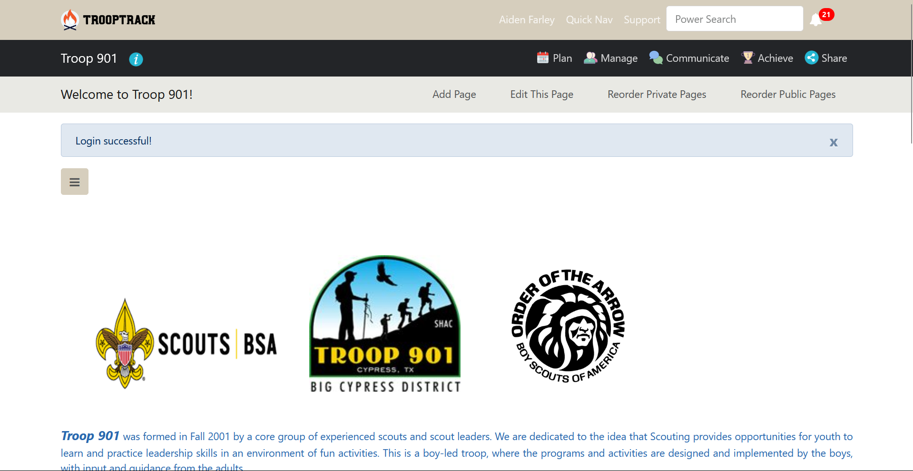

# Logging In
The first step to doing anything with TroopTrack is logging in. If you are a Scout, you parent should know your logon.
1. Navigate to [TroopTrack's website](https://trooptrack.com). 
2. Press the login button in the top right.

3. Type in your login information into the given boxes. If you want to come back later and still be logged in, you can check the `Remember me` box.

4. You are now logged in. You should be at a page that looks something like this.
